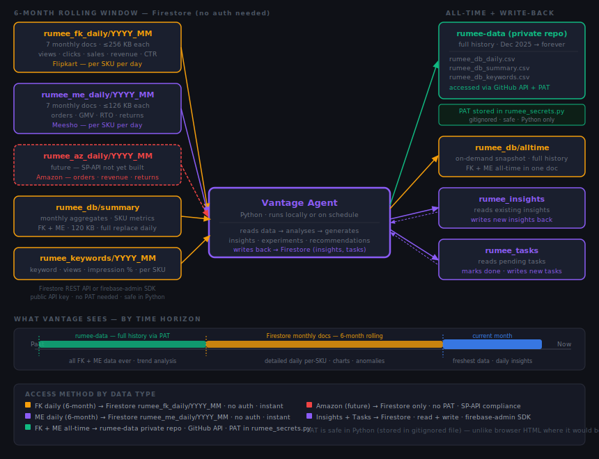

# Vantage — Project Documentation

> **Who this is for:** Any developer or AI assistant working on Vantage. You should be able to understand the full system from this file without reading the code or asking the owner.
>
> **Companion file:** `README.md` covers the generic product design and setup instructions. This file covers the Rumee deployment specifically — decisions made, current state, what is done and what is pending.
>
> **Rule:** When any decision changes, this file must be updated in the same session it changes.

Last updated: 2026-06-26

---

## Table of Contents

1. [What Vantage Is](#1-what-vantage-is)
2. [Rumee Deployment — Overview](#2-rumee-deployment--overview)
3. [Repository Structure](#3-repository-structure)
4. [Data Flow](#4-data-flow)
5. [Runner Files — What Each Does](#5-runner-files--what-each-does)
6. [LLM Configuration](#6-llm-configuration)
7. [Discord Bot](#7-discord-bot)
8. [Data Schema — fk_skus (Critical)](#8-data-schema--fk_skus-critical)
9. [Memory — Where Everything Is Stored](#9-memory--where-everything-is-stored)
10. [Eval Loop Plan](#10-eval-loop-plan)
11. [Cloud Hosting Plan](#11-cloud-hosting-plan)
12. [Build Status](#12-build-status)
13. [Key Decisions](#13-key-decisions)
14. [Buyer Portal Scraper — Planned Feature](#14-buyer-portal-scraper--planned-feature)
15. [How to Run](#15-how-to-run)

---

## 1. Product Vision

**Vantage is a generic, reusable AI growth advisor — not a tool built only for Rumee.**

Rumee Jewellery is the first business running on Vantage — the reference deployment. The product is designed so any ecommerce seller can run their own instance with zero code changes. Only `business_profile.json` and `.env` change between businesses.

**What makes it reusable:**
- `system_prompt.md` — generic expert persona, works for any Indian marketplace seller
- `shared_learnings.json` — universal knowledge (Meesho CQS, Flipkart LQS, seasonal patterns) shared across all businesses
- `business_profile.json` — the only file that is business-specific (name, stage, platforms, focus, LLM choice)
- Memory files (`experiments.json`, `learnings.json`) — per-business, live in the business's own repo

**Monetisation path:** Sellers self-host for free (Groq is free, GitHub is free). A managed version — where we run Vantage as a service for other sellers — is a viable paid product on the same codebase. Each seller gets their own Discord server, GitHub instance, and business profile.

**Rule for development:** Any feature added to Vantage must work for any seller, not just Rumee. Rumee-specific values (webhook URLs, channel IDs, repo paths) live only in `business_profile.json` and `.env` — never in the product code.

---

## 2. What Vantage Is

An AI growth advisor for ecommerce sellers. It reads business data, identifies problems and opportunities, designs experiments with measurable hypotheses, tracks outcomes, and accumulates learnings over time. It is not a one-off analysis tool — it gets smarter the longer it runs.

For the generic product design, see `README.md`.

---

## 2. Rumee Deployment — Overview

**Business:** Rumee Jewellery (rumeein@gmail.com) — artificial jewellery on Flipkart and Meesho.

**Two repos involved:**

| Repo | Path | Role |
|---|---|---|
| vantage-agent | `D:\vantage-agent\` | Generic product — runner scripts, system prompt, shared learnings |
| rumee-dashboard | `D:\Claude RuMee Dashbord\vantage\` | Rumee instance — business profile, memory, environment config |

**Key divergences from the generic README:**
- Uses **Discord** (not Telegram) — Telegram is banned in India
- Reads data from **GitHub raw URLs** (not local CSV files) — no local machine dependency
- Memory files are committed to the **GitHub repo** after every write — not stored only on disk
- LLM is **Groq / llama-3.3-70b-versatile** (free) — not Anthropic or OpenAI

---

## 3. Repository Structure

```
vantage-agent/
├── DOCS.md                     — this file (Rumee deployment doc)
├── README.md                   — generic product design and setup
├── system_prompt.md            — expert persona (the brain)
├── shared_learnings.json       — universal + category learnings
├── runner/
│   ├── agent.py                — nightly analysis runner
│   ├── discord_bot.py          — Discord Q&A bot (replaces telegram_bot.py)
│   ├── telegram_bot.py         — legacy, not used for Rumee
│   ├── context_builder.py      — assembles DB data + memory into LLM context
│   ├── llm_client.py           — LLM-agnostic caller (Anthropic / OpenAI / Groq)
│   └── memory_writer.py        — writes LLM output back to memory files
└── templates/                  — starter templates for new business instances

Rumee instance (separate repo):
D:\Claude RuMee Dashbord\vantage\
├── business_profile.json       — Rumee business config (provider=groq, stage=2)
├── .env                        — GROQ_API_KEY, DISCORD_BOT_TOKEN, DISCORD_CHANNEL_ID
└── memory/
    ├── experiments.json        — all experiments and outcomes
    ├── learnings.json          — what works for Rumee specifically
    └── activity_log.jsonl      — complete audit trail
```

---

## 4. Data Flow



### Data sources — by time horizon

| Time horizon | Source | Access method | Auth |
|---|---|---|---|
| 6-month rolling (FK daily) | Firestore `rumee_fk_daily/YYYY_MM` | Firestore REST API or firebase-admin | Public API key — no PAT |
| 6-month rolling (ME daily) | Firestore `rumee_me_daily/YYYY_MM` | Firestore REST API or firebase-admin | Public API key — no PAT |
| 6-month rolling (Amazon, future) | Firestore `rumee_az_daily/YYYY_MM` | Firestore REST API or firebase-admin | Public API key — no PAT |
| Summary / SKU aggregates | Firestore `rumee_db/summary` | Firestore REST API or firebase-admin | Public API key — no PAT |
| Keywords | Firestore `rumee_keywords/YYYY_MM` | Firestore REST API or firebase-admin | Public API key — no PAT |
| All-time FK + ME history | `rumee-data` private repo | GitHub API + PAT | PAT in `rumee_secrets.py` (gitignored) |
| All-time snapshot (on demand) | Firestore `rumee_db/alltime` | Firestore REST API or firebase-admin | Public API key — no PAT |
| Insights (read + write) | Firestore `rumee_insights` | firebase-admin SDK | `FIREBASE_CREDENTIALS` env var |
| Tasks (read + write) | Firestore `rumee_tasks` | firebase-admin SDK | `FIREBASE_CREDENTIALS` env var |

### Write-back flow

```
Vantage reads data → calls LLM → structured JSON output
    ↓
memory_writer.py:
    → writes new insights to Firestore rumee_insights
    → writes new tasks to Firestore rumee_tasks
    → appends to vantage/memory/activity_log.jsonl (committed + pushed)
    → updates vantage/memory/experiments.json (committed + pushed)
    → updates vantage/memory/learnings.json (committed + pushed)
```

### PAT note

Vantage runs as Python locally — a PAT stored in `rumee_secrets.py` (gitignored) is safe. This is unlike the dashboard (browser HTML, public) where a PAT would be visible to anyone. Vantage can therefore access the full all-time history in `rumee-data` directly.

**Status: DONE (2026-06-24, commit 77eca64)** — `context_builder.py` reads from Firestore for all rolling data. All-time history from `rumee-data` private repo via PAT is available but not yet wired into context_builder (low priority — Firestore covers 6 months which is sufficient for analysis).

---

## 5. Runner Files — What Each Does

### agent.py

Nightly analysis runner. Three modes:

| Mode | Tables loaded | Use when |
|---|---|---|
| `nightly` (default) | fk_monthly, me_monthly, fk_skus, me_skus, me_return_reasons, me_views | Standard daily run |
| `--full-audit` | Three passes — monthly+SKU, recent daily, state+keywords | When you want a complete deep analysis |

Run:
```
python agent.py --instance-path "D:\Claude RuMee Dashbord\vantage"
python agent.py --instance-path "D:\Claude RuMee Dashbord\vantage" --full-audit
```

### context_builder.py

Assembles everything the LLM needs into a single context string:
- Business profile
- All requested DB tables (from GitHub raw URLs — **pending implementation**)
- Active experiments
- Accumulated learnings
- Last 50 activity log events

**Table modes defined in `_PASS_TABLES`** — controls which DB tables go into each pass.

**fk_skus column rename** (applied in `_format_table()` before data reaches LLM):

| Raw column | Renamed to | Why |
|---|---|---|
| `ad_revenue` | `ad_attributed_revenue_rs` | Prevents LLM from treating it as order count |
| `conversions` | `units_sold_via_ads` | Prevents LLM from treating it as return count |
| `ad_views` | `ad_impressions` | Clarity |
| `settlement` | `revenue_earned_rs` | Clarity |
| `stock` | dropped | All zeros — misleads LLM |

### llm_client.py

Reads `provider` and `model` from `business_profile.json`. Supports Anthropic, OpenAI, Groq. For Rumee: Groq / llama-3.3-70b-versatile.

**Groq limit:** 12,000 tokens per minute (free tier). Context is capped at 8,000 chars in discord_bot.py and system prompt truncated to 8,000 chars to stay within this.

### discord_bot.py

Two-way Q&A bot. Holds a permanent WebSocket connection to Discord. Watches channel ID `1517718649429954691` (#pipeline on Rumee Discord server). You type a question → it reads it → replies with full business context.

**Commands:**
| Command | What it does |
|---|---|
| `!status` | Active/suggested experiment counts |
| `!alerts` | Latest alerts from learnings.json |
| Free-form text | LLM Q&A with full business context |

**Bot details:**
- Name: vantage#8332
- Application ID: 1517859731539234826
- Requires Message Content Intent ON in Discord Developer Portal

### brief_builder.py

Reads data from Firestore + `pipeline_run_log.json` and writes a compressed `daily_brief.txt` (~1,500 tokens vs ~8,000 for raw tables). Run after the pipeline before the nightly agent or Discord bot session.

**Output:** `D:\Claude RuMee Dashbord\vantage\daily_brief.txt`

**What it builds:**

| Section | Source | Notes |
|---|---|---|
| DATA HEALTH | `pipeline_run_log.json` | Stream status, last date, row counts for all 11 streams. Gaps tagged `[GAP]`/`[PARTIAL]`/`[NOT IN BRIEF]` |
| FK monthly | Firestore `rumee_db/summary` → `fk_monthly` | Last 3 months, return rate alarm if >50% |
| FK ad earners | Firestore `rumee_db/summary` → `fk_skus` | Top 8 by ad revenue |
| FK daily velocity | Firestore `rumee_orders_daily` | Last 7 days of real fulfilment orders |
| ME monthly | Firestore `rumee_db/summary` → `me_monthly` | Last 3 months — **delivered orders only**, lags current month by ~5-7 days (settlement delay) |
| ME daily velocity | Firestore `rumee_me_daily` | Last 7 days of `orders_placed` (all statuses including in-transit) — use this for current month activity |
| ME SKUs + return reasons | Firestore `rumee_db/summary` | Top 8 sellers, high-return SKUs, top reasons |
| Experiments + activity | `memory/` files | Local — no Firestore call |

**Coverage spec (`_COVERAGE` dict):** Maps each pipeline stream to a lambda that asserts the brief has visible data for that stream. Checked after data loads — any stream the pipeline marks `ok` but the brief can't see is flagged `[NOT IN BRIEF]`.

**Discord alert:** If any pipeline gap or coverage gap is detected, sends a red embed to Discord (same webhook as `process.py`). Clean runs are silent.

**Run:**
```
cd D:\vantage-agent\runner
python brief_builder.py --instance-path "D:\Claude RuMee Dashbord\vantage"
```

### memory_writer.py

Parses LLM JSON output and writes to `experiments.json`, `learnings.json`, and `activity_log.jsonl`. After writing, must commit + push to GitHub repo (**pending implementation**).

---

## 6. LLM Configuration

Set in `D:\Claude RuMee Dashbord\vantage\business_profile.json`:

```json
"llm": {
  "provider": "groq",
  "model": "llama-3.3-70b-versatile"
}
```

**Why Groq:** Free, no credit card, 70B quality model. Sufficient for nightly analysis and Discord Q&A.

**To switch to Claude:** Change provider to `anthropic`, model to `claude-sonnet-4-6`, add `ANTHROPIC_API_KEY` to `.env`. All memory files and system prompt work unchanged — no migration needed.

---

## 7. Discord Architecture — Full Picture

All Discord communication uses one Rumee Discord server with separate channels per purpose.

| Component | Type | Channel | Direction | Needs cloud server? |
|---|---|---|---|---|
| Vantage bot (`discord_bot.py`) | Bot — token-based, WebSocket | #pipeline | Two-way — reads messages, replies | **Yes** — must be alive 24/7 |
| AutoSync notification | Webhook — HTTP POST only | #auto-sync | One-way — posts only, never reads | **No** — Chrome extension fires it once per sync run |

**Why the bot needs a cloud server:**
The bot holds an open WebSocket connection to Discord continuously. When you type in #pipeline, Discord pushes the message to the bot in real time. If the bot process dies, nobody is listening. Cloud hosting (Fly.io) keeps the process alive even when the local PC is off.

**Why the webhook does not need a server:**
A webhook is a single HTTP POST. AutoSync fires it once when sync completes, Discord receives it, message appears. Nothing needs to stay running. The Chrome extension is the sender — it posts and moves on.

---

## 8. Discord Bot

**Status: Built and tested locally. Not yet hosted on cloud server.**

**Credentials in `D:\Claude RuMee Dashbord\vantage\.env`:**
```
GROQ_API_KEY=...
DISCORD_BOT_TOKEN=...
DISCORD_CHANNEL_ID=1517718649429954691
```

**To run locally:**
```
cd D:\vantage-agent\runner
python discord_bot.py --instance-path "D:\Claude RuMee Dashbord\vantage"
```

**Bot invite URL (already done — do not re-invite):**
`https://discord.com/oauth2/authorize?client_id=1517859731539234826&permissions=68608&scope=bot`

**Known gotcha:** Message Content Intent must be ON in Discord Developer Portal or the bot sees empty messages.

---

## 8. Data Schema — fk_skus (Critical)

`fk_skus` contains **Flipkart ad performance data only**. It does NOT contain order counts or return counts per SKU. Only monthly totals exist in `fk_monthly`.

| Column (after rename) | What it means | What it is NOT |
|---|---|---|
| `ad_attributed_revenue_rs` | Revenue (₹) earned via ad-driven sales | Not order count |
| `units_sold_via_ads` | Units sold specifically via ads | Not return count |
| `ad_impressions` | Times the ad was shown | Not product page views |
| `revenue_earned_rs` | Settlement payout from Flipkart | Not profit |

If asked about FK orders or returns per SKU: **no data exists — say so, do not infer**.

**Real FK return rate:** 43–65% per month (from `fk_monthly`) — alarming, high priority.
**Real Meesho return rate:** 9–15% per month. Per-SKU highest: DJ-14 at 21.4%.

---

## 9. Memory — Where Everything Is Stored

All memory lives in `D:\Claude RuMee Dashbord\vantage\memory\`:

| File | What it holds |
|---|---|
| `experiments.json` | All experiments: status (suggested/monitoring/success/failure), hypothesis, baseline, evaluate_after_days |
| `learnings.json` | What works for Rumee specifically. Also holds alerts from last run. |
| `activity_log.jsonl` | One JSON line per event — every run, every Discord message, every experiment update |

**Decision (2026-06-20):** After every write, memory files are committed and pushed to the GitHub repo. Nothing stored only on local disk. **DONE — implemented in memory_writer.py.**

---

## 10. Eval Loop

Automated quality gate: run test questions through Vantage (Claude Opus), judge answers with Claude Haiku, score and patch system_prompt/rubrics.

**Status: ACTIVE. Round 2 next.**

### Models and cost
| Role | Model | Cost |
|---|---|---|
| Vantage (answers) | claude-opus-4-8 | ~₹4.5/question |
| Judge | claude-haiku-4-5 | ~₹0.35/question |
| Budget per run | ₹200 | ~41 questions max |

### Files
```
D:\vantage-agent\eval\
├── test_suite.json    — 40 questions across 6 categories
├── run_eval.py        — main loop: Opus answer → Haiku judge → log
├── eval_log.jsonl     — per-run results (append-only)
└── publish_eval.py    — generates docs/eval_report.html from log
```

### Test categories (40 questions)
| Category | Questions | What is tested |
|---|---|---|
| fk_skus_interpretation | 8 | Reads fk_ads_sku correctly, no hallucination on ad data |
| return_rate | 6 | Per-SKU and platform-level return rate from me_skus/fk_skus |
| stage_calibration | 8 | Refuses enterprise tactics for Stage 1/2 business |
| experiment_format | 8 | Hypothesis + baseline + evaluate_after_days in every suggestion |
| no_hallucination | 6 | Refuses questions that have no data; never invents numbers |
| advice_quality | 4 | Data-aware prioritization; correct platform labeling |

### Run command
```
python eval/run_eval.py --instance-path "D:\Claude RuMee Dashbord\vantage" --budget-inr 200 --max-rounds 1
```

### MANDATORY eval discipline — NO EXCEPTIONS
**6 questions per round. Stop after every round. Review answers AND judge verdicts before continuing.**

**Step 1 — Run the round:**
`python eval/run_eval.py --instance-path "D:\Claude RuMee Dashbord\vantage" --budget-inr 200 --max-rounds 1`

**Step 2 — Read every answer (Vantage output):**
- Did it cite real data or invent something?
- Did it follow experiment format where required?
- Did it refuse correctly, or refuse something it should have answered?

**Step 3 — Judge the judge (mandatory meta-review):**
For every verdict, ask: is the judge correct?
- Did the judge have the data it needed to verify citations? (judge gets data context since 2026-06-26)
- Is the judge applying the rubric correctly, or being too strict on phrasing?
- Is the judge calling something a hallucination when the number IS in the data?
- Is the rubric itself stale (data has changed since rubric was written)?

Classify each verdict as one of:
- **GENUINE model error** — Vantage was actually wrong
- **JUDGE ERROR** — Vantage was right, judge misfired (cite why)
- **STALE RUBRIC** — Vantage was right, rubric is outdated (fix rubric, don't count as fail)

Only GENUINE model errors count as failures that block the next round.

**Step 4 — Decision:**
- All 6 are PASS or JUDGE ERROR / STALE RUBRIC → report to user, get go-ahead for next round
- Any GENUINE model error → STOP. Start new fix session. Only then continue.

**Why:** The judge (Haiku) can be wrong. Round 1 proved it — q011 was called hallucination but the number was real. Accepting every judge verdict blindly produces a corrupted eval corpus.

### Round history
| Round | Date | Questions | Pass | Spend | Notes |
|---|---|---|---|---|---|
| Full 40Q | 2026-06-26 | 40 | 30/40 | ₹179 | Opus baseline. Stage-1 trust gate passed (zero hallucinations). Main gap: experiment_format 3/8. |
| Round 1 | 2026-06-26 | 6 | 5/6 | ₹27 | 83% pass. q037 fail = stale rubric (human analysis). |

### Pre-run checklist (before any new round)
- [ ] All questions from last round reviewed and root-caused (not just scored)
- [ ] Any system_prompt fix applied and confirmed
- [ ] Any stale rubrics updated in test_suite.json
- [ ] daily_brief.txt is current (run brief_builder.py if needed)
- [ ] ANTHROPIC_API_KEY is set in D:\Claude RuMee Dashbord\vantage\.env

### Fixes applied before Round 2 (2026-06-27)
- experiment_format Rules 6/7/8 added to system_prompt (alert-first, plans decompose, format mandatory in Q&A)
- q039 rubric updated: ROAS IS now available from fk_ads_sku — do not refuse on "uncomputable" grounds
- ME ads data wired into brief (me_ads_catalog, me_ads_daily) — Meesho ads ROI now visible to Vantage
- FK ads per-SKU ROAS + daily trend in brief since 2026-06-27
- Meesho June 0 in me_monthly = settlement lag (not collapse) — daily shows ~12 orders/day

---

## 11. Cloud Hosting Plan

**Decision (2026-06-20):** Vantage runs entirely on cloud. No local machine involved after setup.

| Component | Where it runs | Status |
|---|---|---|
| Nightly audit (agent.py) | GitHub Actions — scheduled daily | Not yet implemented |
| Discord Q&A bot (discord_bot.py) | Cloud server — 24/7 (Fly.io or equivalent) | Not yet implemented |
| Memory writes | Committed + pushed to GitHub repo | Not yet implemented |

**GitHub Actions secrets needed:**
| Secret | Value |
|---|---|
| `GROQ_API_KEY` | Groq API key |
| `DISCORD_BOT_TOKEN` | Discord bot token |
| `DISCORD_CHANNEL_ID` | 1517718649429954691 |

---

## 12. Build Status

| Component | Status |
|---|---|
| system_prompt.md — expert persona | Done |
| agent.py — nightly runner | Done |
| context_builder.py — assembles context | Done |
| llm_client.py — Groq/Anthropic/OpenAI | Done |
| memory_writer.py — writes experiments + learnings | Done |
| discord_bot.py — Discord Q&A | Done, tested locally |
| First full-audit run | Done (2026-06-20) — 4 alerts, 4 experiments, 3 learnings |
| fk_skus column rename (data standardization) | Done (2026-06-20) |
| system_prompt.md — Data Schema section | Done (2026-06-20) |
| system_prompt.md — Discord response format | Done (2026-06-20) |
| context_builder.py reads from Firestore | Done (2026-06-24, commit 77eca64) |
| memory_writer.py commits + pushes to GitHub | Done (2026-06-20) |
| brief_builder.py — compressed daily brief | Done (2026-06-26, commits f2f348a / 47766fe / c9a1248 / 5ba4b37) |
| brief_builder.py — Meesho daily velocity (orders_placed) | Done (2026-06-26) — fixes false zero-sales for current month |
| brief_builder.py — DATA HEALTH block | Done (2026-06-26) — stream status + dates + row counts in every brief |
| brief_builder.py — coverage spec + [NOT IN BRIEF] flag | Done (2026-06-26) — catches pipeline-ok but brief-invisible gaps |
| brief_builder.py — Discord gap alert | Done (2026-06-26) — red embed on any pipeline or coverage gap |
| Nightly audit on GitHub Actions | Blocked — intentionally. Only after eval loop confirms output quality. |
| Discord bot on cloud server (24/7) | **Pending** |
| Eval loop (automated training) | Not started |
| onboard.py (new business onboarding) | Not started |
| Buyer portal scraper (AutoSync job) | Planned — blocked on URL collection. FK URLs: extract from fk_listings download. Meesho URLs: manual one-time collection. |
| context_builder.py reads listing_snapshot | Planned — after AutoSync scraper is built |

---

## 13. Key Decisions

| Decision | What was decided | Date |
|---|---|---|
| Communication platform | Discord (not Telegram — banned in India) | 2026-06-19 |
| LLM provider | Groq / llama-3.3-70b-versatile (free) | 2026-06-20 |
| Data source | Firestore (rolling 6 months) — not GitHub raw CSV URLs | 2026-06-24 |
| Memory storage | Committed to GitHub repo after every write — not local disk only | 2026-06-20 |
| No local machine | Everything runs on GitHub Actions + cloud server after setup | 2026-06-20 |
| fk_skus interpretation | Ad performance data only — no SKU-level orders or returns exist | 2026-06-20 |
| Eval loop budget | ₹500 hard cap — hardcoded in script + Anthropic console limit as backup | 2026-06-20 |
| Cloud hosting platform | Fly.io (free tier, always on) — to be confirmed | 2026-06-20 |
| me_monthly current month | Always 0 until orders settle (5-7 day lag). Use `me_daily.orders_placed` for current-month activity. | 2026-06-26 |
| Brief data integrity | Every brief runs coverage spec + DATA HEALTH block. Gaps trigger Discord alert. Adding a new pipeline stream requires updating `_COVERAGE` in brief_builder.py. | 2026-06-26 |
| Buyer portal scraper ownership | Lives in AutoSync (Chrome extension), not Vantage. Data acquisition = AutoSync's job. Output to Firestore `rumee_listing_snapshot`. | 2026-06-26 |
| Buyer portal scraper frequency | Weekly. All 5 gap items (rating, reviews, badges, Q&A, people-also-viewed) on same schedule. | 2026-06-26 |

---

## 14. Buyer Portal Scraper — Planned Feature

Gives Vantage visibility into what buyers see on Flipkart and Meesho listing pages.

### What to scrape (not available in any current download)

| Item | FK | Meesho | Notes |
|---|---|---|---|
| Rating average + count | Y | Y | Strongest buyer trust signal |
| Reviews (text, star, date, verified) | Y | Y | Top 10 per SKU — only source of buyer voice |
| Badges (FK Assured, etc.) | Y | Y | Loss of badge = direct conversion hit |
| Q&A (buyer questions + answers) | Y | — | Reveals listing gaps |
| "People also viewed" sidebar | Y | Y | Competitive context |

### What is NOT scraped (already in daily downloads)

Title, description, price, stock, specs, category — all in the listing download. Price variation visible in orders data.

### Architecture

```
AutoSync (Chrome extension) — weekly scraper job
    → visits buyer-facing product URLs (flipkart.com, meesho.com)
    → real Chrome session: JS-rendered reviews/ratings load naturally
    → writes to Firestore: rumee_listing_snapshot/{SKU}

Vantage (context_builder.py)
    → reads rumee_listing_snapshot from Firestore
    → brief surfaces: rating changes, badge status, latest negative review summary
    → full snapshot available for on-demand queries ("show me 1-star reviews for DJ-14")
```

### URL status

| Platform | Status |
|---|---|
| Flipkart | FSN in listing file for all SKUs. Full buyer URL needed (FSN-only = E002). "Link for Buyer Portal" column in fk_listings — populated for some SKUs. AutoSync fk_listings job to extract + store these. |
| Meesho | No URLs in any download. Manual one-time collection (~20 SKUs). |

### Firestore collection

`rumee_listing_snapshot` — one doc per SKU, weekly overwrite. Schema:
```json
{
  "sku": "DJ-14",
  "platform": "meesho",
  "scraped_at": "2026-06-29",
  "rating_avg": 4.2,
  "rating_count": 138,
  "reviews": [{"star": 1, "text": "...", "date": "...", "verified": true}],
  "badges": ["Meesho Assured"],
  "qa": [{"question": "...", "answer": "..."}],
  "people_also_viewed": [{"title": "...", "url": "..."}]
}
```

---

## 15. How to Run

### Nightly analysis (local, for testing)
```
cd D:\vantage-agent\runner
python agent.py --instance-path "D:\Claude RuMee Dashbord\vantage"
```

### Full audit (local, for testing)
```
cd D:\vantage-agent\runner
python agent.py --instance-path "D:\Claude RuMee Dashbord\vantage" --full-audit
```

### Discord bot (local, for testing)
```
cd D:\vantage-agent\runner
python discord_bot.py --instance-path "D:\Claude RuMee Dashbord\vantage"
```

### Production (once GitHub Actions is set up)
- Nightly audit runs automatically on schedule — no manual step
- Discord bot runs on cloud server — no manual step
- Memory writes commit + push to GitHub automatically — no manual step
